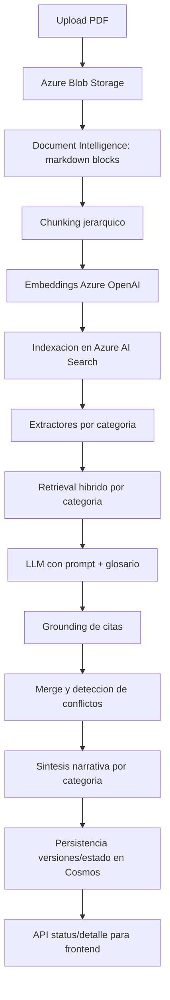

# Documentacion del Flujo RAG y Mejoras Propuestas

## Objetivo

Documentar el flujo RAG actual de CedIA en produccion (Azure + Cosmos) y explicar como las stories 2.16-2.20 mejoran calidad, robustez y operabilidad.

## Stack de referencia (produccion)

- Extraccion de texto: Azure AI Document Intelligence (layout markdown)
- Chunking: logica propia jerarquica (titulos + parrafos + tablas)
- Embeddings: Azure OpenAI Embeddings
- Vector store y retrieval: Azure AI Search (hibrido BM25 + vector)
- LLM extraccion/sintesis: Azure OpenAI Chat
- Runtime y estado de analisis: Cosmos DB (modo cosmos_only/cosmos_temporal)

## Flujo RAG actual end-to-end

## Paso a paso tecnico

### 1) Ingesta y preproceso

1. El usuario sube PDF y selecciona documento principal.
2. El archivo se guarda en Blob Storage.
3. Se valida formato, cantidad y limites de paginas.

Resultado: analisis en estado draft/queued con correlation_id para trazabilidad.

### 2) Extraccion estructurada de texto

1. Document Intelligence devuelve markdown con headings, parrafos y tablas.
2. Se arma bloque intermedio con orden de lectura.

Resultado: bloques enriquecidos listos para chunking semantico.

### 3) Chunking jerarquico

1. Se preserva jerarquia de titulos (`heading_path`).
2. Se fusionan parrafos consecutivos de misma seccion.
3. Tablas se tratan como unidades con contexto de encabezado/parrafo previo.
4. Se aplican tamano de chunk y overlap controlado.

Resultado: chunks con metadata (document_id, page_number, section_path, block_type).

### 4) Embeddings e indexacion

1. Se generan embeddings por lotes con retries.
2. Se suben documentos al indice de Azure Search.
3. Se valida contrato de indice en produccion (campos criticos y dimensiones).

Resultado: indice vectorial consultable por analysis_id.

### 5) Retrieval por categoria (RAG)

1. Cada extractor define query semantica de categoria.
2. Se construye `keyword_query` desde glosario (`query_terms + aliases`).
3. Azure Search ejecuta busqueda hibrida BM25 + vector.
4. Se aplica fallback wildcard cuando no hay resultados.

Resultado: top chunks relevantes para cada categoria.

### 6) Extraccion con LLM y grounding

1. El LLM recibe prompt de categoria + bloques de contexto.
2. Debe responder JSON con fuentes (`source_references`).
3. Se verifica que cada cita exista realmente en los chunks recuperados.
4. Si no verifica, se degrada estado del item a `partial`.

Resultado: salida estructurada con menor riesgo de alucinacion.

### 7) Merge, conflictos y sintesis

1. Se normalizan tipos y se deduplican hechos equivalentes.
2. Se detectan conflictos entre documentos/versiones.
3. Se genera narrativa por categoria para lectura de negocio.

Resultado: `extracted_data` consolidado y versionado.

### 8) Persistencia y exposicion API

1. Se guarda version del analisis y metadata de extraccion.
2. Cosmos mantiene estado runtime y versiones.
3. Frontend consulta status/detalle.

Resultado: flujo completo visible para usuario final.

## Fortalezas actuales

1. Pipeline robusto de cloud-first para produccion.
2. Retrieval hibrido con fallback seguro.
3. Grounding de citas y penalizacion anti-alucinacion.
4. Validaciones de configuracion cloud e indice.

## Gaps actuales

1. Falta observabilidad fina de retrieval/grounding para operar por metricas.
2. Falta evaluación retrieval formal con quality gates en CI.
3. No hay reranking explicito antes del LLM.
4. Idempotencia de indexacion mejorable en reprocesos.
5. Sinonimos viven fuerte en glosario/prompt, no tanto en capa de busqueda.

## Como mejoran las nuevas stories (2.16-2.20)

### Story 2.16 - Observabilidad retrieval/grounding

Mejora:

- Hace visible latencia, recall proxy y calidad de grounding por categoria.
- Permite detectar degradacion antes de impactar resultados de negocio.

Impacto esperado:

- Menor tiempo de diagnostico.
- Base objetiva para optimizaciones posteriores.

### Story 2.17 - Evaluacion retrieval + quality gates

Mejora:

- Introduce precision@k, recall@k, MRR, nDCG como criterio de calidad.
- Bloquea en CI cambios que degradan retrieval.

Impacto esperado:

- Menos regresiones silenciosas.
- Evolucion de prompts/ranking con control estadistico.

### Story 2.18 - Reranking explicito top-k

Mejora:

- Reordena candidatos para maximizar relevancia de contexto entregado al LLM.
- Incorpora feature flag y fallback seguro.

Impacto esperado:

- Mayor precision semantica en categorias ambiguas.
- Menor probabilidad de respuesta parcialmente incorrecta.

### Story 2.19 - Idempotencia + cleanup stale chunks

Mejora:

- IDs deterministicas de chunk.
- Reprocesos sin duplicados funcionales.
- Limpieza de chunks obsoletos por analysis_id.

Impacto esperado:

- Indice consistente a traves del tiempo.
- Reduccion de ruido en retrieval.

### Story 2.20 - Sinonimos en busqueda + hardening operacional

Mejora:

- Lleva sinonimos al retrieval para ampliar recall con vocabulario heterogeneo.
- Endurece timeout, fallback y alertas de salud del pipeline.

Impacto esperado:

- Mejor cobertura ante redacciones no estandar.
- Mayor resiliencia en condiciones reales de carga/falla.

## Vista comparativa (antes vs despues)

| Dimension | Estado actual | Estado objetivo 2.16-2.20 |
|---|---|---|
| Observabilidad retrieval | Basica | Detallada por categoria con baseline |
| Grounding | Verificacion existente | Verificacion + metricas operativas |
| Evaluacion retrieval | Manual/ad hoc | Automatizada con quality gates |
| Ranking contexto | Hibrido base Azure | Hibrido + reranking controlado |
| Idempotencia indice | Parcial | Deterministica con cleanup stale |
| Sinonimos | Glosario/prompt | Glosario + capa retrieval |
| Operacion | Reactiva | Proactiva con alertas y SLO |

## Plan de adopcion recomendado

1. Implementar stories en orden 2.16 -> 2.17 -> 2.18 -> 2.19 -> 2.20.
2. No habilitar reranking en productivo sin baseline de PR-A y gates de PR-B.
3. Ejecutar A/B por categoria critica antes de promover cambios de ranking/sinonimos.
4. Mantener rollback por feature flags y runbook actualizado.

## Indicadores de exito sugeridos

- Precision@k y nDCG en alza en categorias criticas.
- Tasa de `cita_no_verificada` en baja.
- Menor tasa de `not_found` en categorias con alto sinonimo.
- Latencia P95 dentro del SLO acordado.

## Referencias internas

- backend/extraction/chunking.py
- backend/extraction/embeddings.py
- backend/extraction/ai_search.py
- backend/shared/ports/azure_search.py
- backend/analysis/extraction/extractors/base.py
- backend/analysis/extraction/graph.py
- backend/analysis/cosmos_runtime.py
- docs/cosmos-temporal-runbook.md
- _bmad-output/implementation-artifacts/2-16-observabilidad-retrieval-y-grounding-rag.md
- _bmad-output/implementation-artifacts/2-17-evaluacion-retrieval-y-quality-gates.md
- _bmad-output/implementation-artifacts/2-18-reranking-explicito-top-k-con-feature-flag.md
- _bmad-output/implementation-artifacts/2-19-idempotencia-de-indexacion-y-cleanup-stale-chunks.md
- _bmad-output/implementation-artifacts/2-20-sinonimos-en-indice-y-hardening-operacional-rag.md
